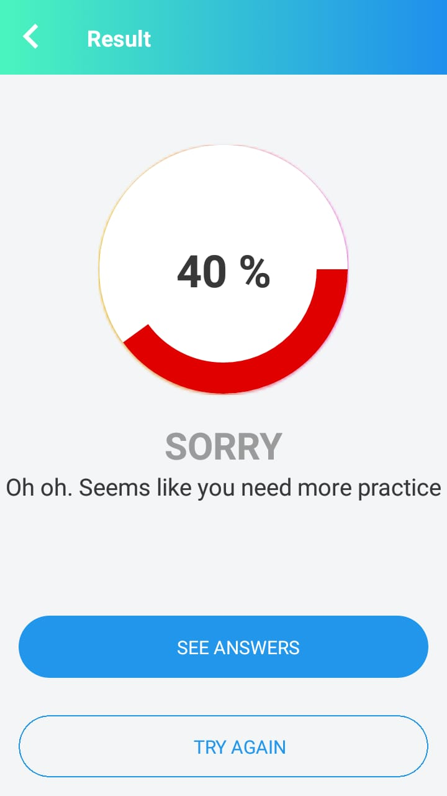
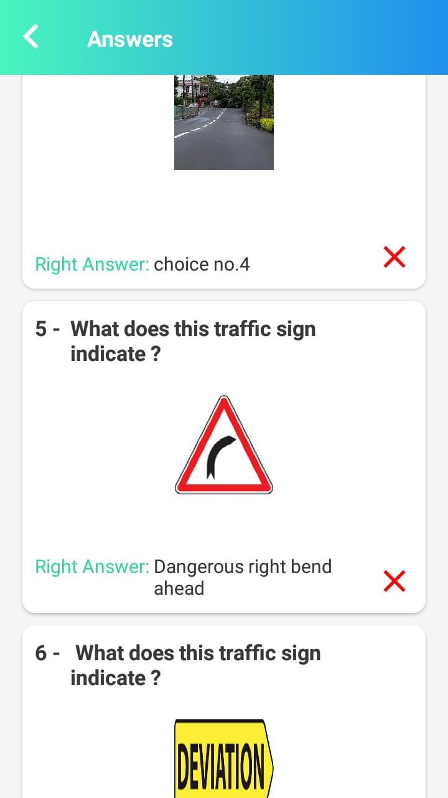
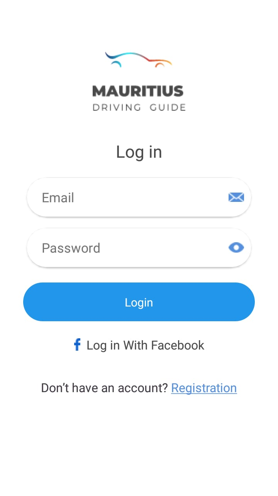
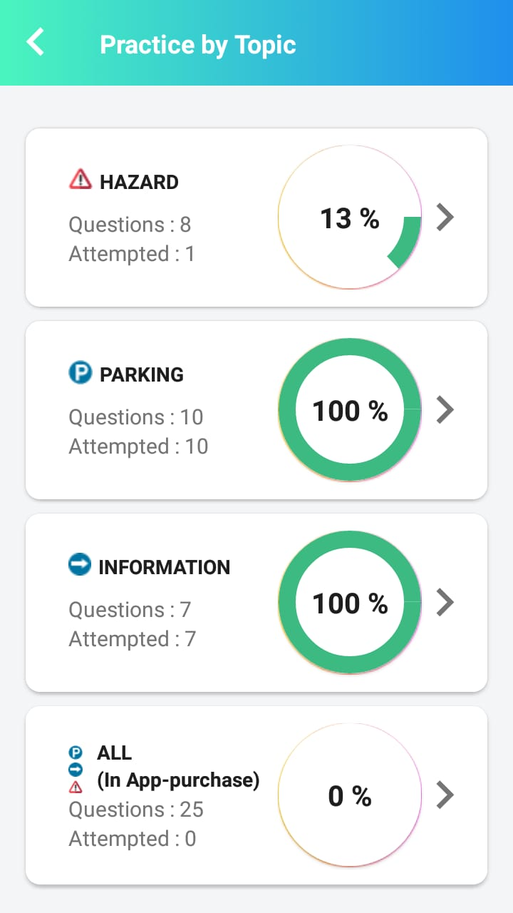

## quiz-application
Cross-platform mobile app for Android and iOS written with React Native.

## Screeshots

* ## Prerequisites
1. Globally installed React native  - `npm install -g react-natice-cli`
2. Mac OS to build iOS app.

## Installation
This app is built with the React Native CLI. Once you have the [CLI installed](https://docs.reactnative.org/start/quick-setup), start by cloning the repo:
1. `git clone https://github.com/RedskyAtech/dating-app.git`
2. `cd quiz-app`
3. `npm install` 

## Run iOS Application
`react-native run-ios` 

## Run Android Application
`react-native run-android`

    

